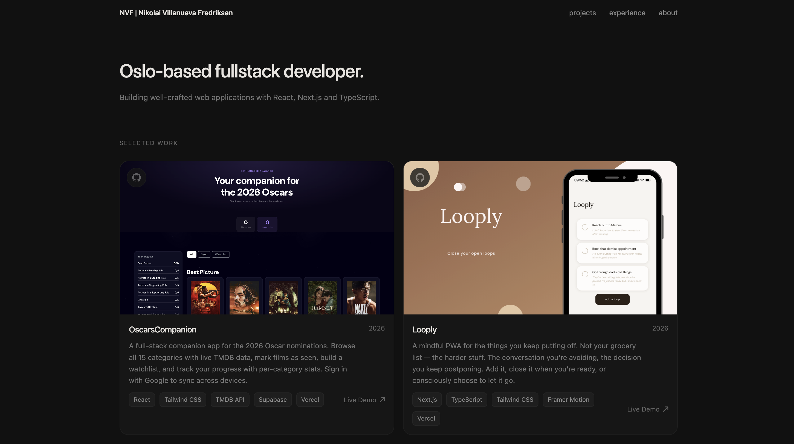

# Portfolio Website — Nikolai Villanueva Fredriksen



Personal developer portfolio built with React and Vite.

## Tech Stack

- **React 19** + **Vite 7**
- **Tailwind CSS v4**
- **Framer Motion** — page and component animations
- **React Three Fiber** + **Three.js** — 3D elements
- **React Router DOM v7** — client-side routing
- **EmailJS** — contact form without a backend
- **React Vertical Timeline Component** — experience/timeline section

## Getting Started

```bash
# Clone the repo
git clone https://github.com/NikolaiVFredriksen/WebsitePortfolio.git
cd WebsitePortfolio

# Install dependencies
npm install

# Start dev server
npm run dev
```

The app runs on `http://localhost:5173` by default.

## Scripts

| Command           | Description                          |
| ----------------- | ------------------------------------ |
| `npm run dev`     | Start local dev server with HMR      |
| `npm run build`   | Production build to `dist/`          |
| `npm run preview` | Preview the production build locally |
| `npm run lint`    | Run ESLint                           |

## Project Structure

```
src/
├── assets/          # Images, icons, 3D models
├── components/      # Reusable UI components
├── constants/       # Content data (projects, experience, etc.)
├── hoc/             # Higher-order components
├── utils/           # Helper functions
└── App.jsx          # Root component and routing
```

## Deployment

Deployed on **Vercel**. Push to `main` triggers a new deployment automatically.

## Contact

Built and maintained by Nikolai Villanueva Fredriksen.
